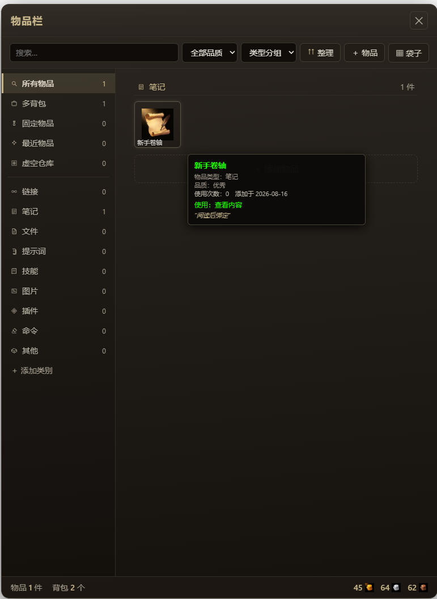
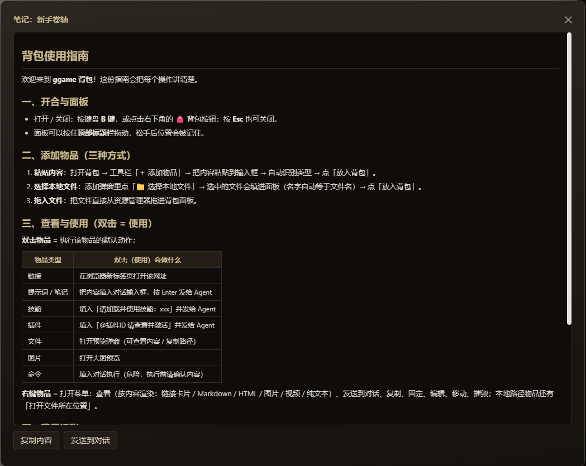
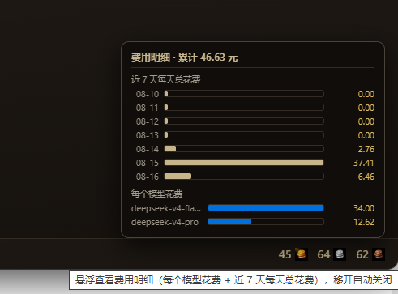
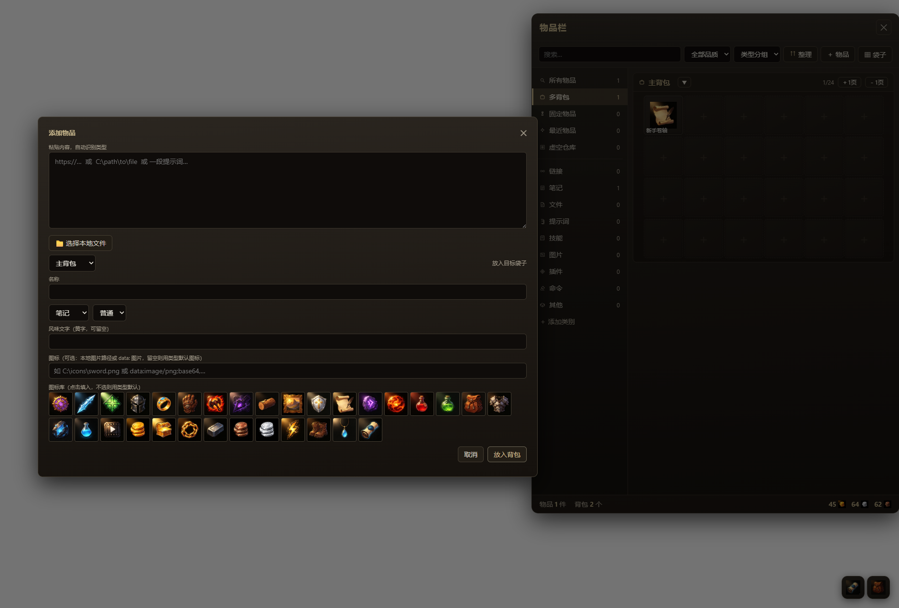

# DSH 背包（Backpack）

DeepSeek Harness 常驻插件：魔兽世界风格的物品栏 / 背包系统。右下角背包按钮展开物品栏，把 Agent 回复里的链接、提示词、文件路径一键「拾取」入库，同时自动统计**所有会话（含已归档）的 token 费用**，按 DeepSeek 官方动态定价换算成金币/银币/铜币。

> 适用于 DSH Web profile（`dsh web`）。本插件以**常驻 bundle** 形式安装，重启 DSH 后依然生效（区别于会话级动态插件）。

## 特性

- 🎒 **物品栏**：右下角 FAB 展开/收起（快捷键 `B`），无限袋子、分页管理（每页 6×4），虚空仓库（超容自动收纳、不可删除）
- 🏷️ **物品类型**：链接 / 提示词 / 笔记 / 技能 / 文件 / 图片 / 插件 / 命令 / 其他，支持自定义类别（侧栏「＋添加类别」）
- ⭐ **WoW 质感**：品质颜色（粗糙→传说）、黄字风味文字、悬浮信息卡、右键菜单（查看/发送/复制/固定/编辑/移动/摧毁）
- 🖱️ **交互**：拖拽移动物品、拖入文件生成物品、粘贴内容自动识别类型、图标库挑选
- 🔎 **查看详情**：右键「查看」按内容自动渲染——链接卡片（可点击）、Markdown 富文本、HTML 沙箱页面（iframe，脚本不执行）、图片/纯文本
- 💰 **费用记账**：扫描全部会话日志（`sessionQuery`，旋转批次增量），按模型 + 请求时段套用 DeepSeek 官方定价；**悬浮金额**弹出卡片查看近 7 天每日总花费与每个模型花费（移开自动关闭）
- 🤖 **Agent 工具**：`backpack_add` / `backpack_money` / `backpack_search`（Agent 检索背包作长期记忆库）
- 🔍 **检索**：搜索（/ 快捷键聚焦）、品质过滤、排序、一键整理、Shift+点击批量多选、拖拽放置预览
- 🖱️ **交互**：面板可拖拽并记住位置、Esc 关闭、toast 分色、保存状态指示、选中描边

## 环境要求

- DeepSeek Harness（`dsh`），Web profile
- 依赖的 peer 包（DSH 自带）：`@deepseek-ai/cordis`、`@deepseek-ai/dsh-tools`、`@deepseek-ai/dsh-settings`、`@deepseek-ai/schemastery`、`react`

## 安装

以本地 workspace 包方式装入你的 web profile：

1. **放入源码**：把本仓库放到 profile 的 packages 目录，例如 `~/.dsh/profiles/web/packages/backpack`。
2. **注册 workspace**：编辑 `~/.dsh/profiles/web/pnpm-workspace.yaml`：

   ```yaml
   packages:
     - .
     - packages/*
   ```

3. **声明依赖与 bundle**：编辑 `~/.dsh/profiles/web/package.json`：

   ```json
   {
     "dependencies": { "@ggame/backpack": "workspace:*" },
     "dsh": {
       "profile": {
         "bundles": [
           "@deepseek-ai/dsh-base",
           "@deepseek-ai/dsh-web-app",
           "@ggame/backpack"
         ]
       }
     }
   }
   ```

4. **安装**：在 profile 目录执行 `pnpm install`。
5. **配置行**：在 `~/.dsh/profiles/web/cordis.patch.yml` 追加：

   ```yaml
   - id: backpack
     config:
       autoScan: true
       scanIntervalSec: 60
   ```

6. **重启 DSH**：`dsh web`。之后浏览器右下角会出现背包按钮。

> 若你的 profile 已启用其他 bundle（如 vision-toolkit），把 `@ggame/backpack` 追加进 `bundles` 列表即可，互不影响。

## 截图

| 背包面板 | 物品查看（Markdown 详情） |
|---|---|
|  |  |

| 费用明细（悬浮金额卡片） | 添加物品 |
|---|---|
|  |  |

## 使用

| 操作 | 方式 |
|---|---|
| 开合背包 | 右下角按钮或按 `B` |
| 查看物品 | 右键 →「查看」：链接卡片 / Markdown 富文本 / HTML 沙箱页面 / 图片 / 纯文本（可复制、发送到对话） |
| 使用物品 | 双击（链接打开、提示词/命令发送到输入框、技能/插件生成调用文本、图片/文件预览） |
| 菜单 | 右键物品：查看 / 发送到对话 / 复制 / 固定 / 编辑 / 移动到其他袋 / 移入虚空仓库 / 摧毁 |
| 移动 | 拖拽物品到其他格子或袋子标题栏 |
| 拾取 | Agent 回复右上角的「⚡拾取」按钮，批量识别链接与路径入库 |
| 添加 | 面板「＋物品」，粘贴内容自动识别类型；或直接把文件拖进面板 |
| 整理 | 工具栏「整理」：按品质排序回袋，不好分类的进虚空仓库再按类别拉回 |
| 费用明细 | 鼠标悬浮底部金额（金币/银币/铜币）→ 上方弹出卡片：近 7 天每日总花费 + 每个模型花费（移开自动关闭） |

物品类型自动识别规则：`https://…`→链接；`@插件id`→插件；本地路径→图片/文件；命令特征→命令；长文本→提示词。

## 配置（设置 → 插件 → 插件配置 → 背包）

| 字段 | 默认 | 说明 |
|---|---|---|
| `statePath` | `~/.dsh/backpack-state.json` | 状态文件路径（留空用默认） |
| `autoScan` | `true` | 定时扫描会话日志记账 |
| `scanIntervalSec` | `60` | 扫描间隔（秒，10–86400） |
| `peakPricing` | `true` | 是否启用峰谷计价（见下） |
| `prices` | `{hit:0.02, miss:1, out:2}` | 未单独配置模型的默认单价（元/百万 tokens） |
| `modelPrices` | `{}` | 按模型覆盖单价，如 `{"deepseek-v4-pro": {"hit":0.025,"miss":3,"out":6}}` |

## 货币与费用记账

- 约定：**金币=元，银币=角，铜币=分**（1 金 = 100 银 = 10000 铜）。
- 数据来源：`sessionQuery` 读取全部会话日志（live + 已归档），从 `assistant/message` 事件提取真实 `TokenUsage`（`inputTokens` + `cacheWriteTokens` 按未命中输入计，`cacheReadTokens` 按命中输入计，`outputTokens` + `reasoningTokens` 按输出计），从 `request/header` 事件取模型名。
- 官方定价（元/百万 tokens，[DeepSeek 定价文档](https://api-docs.deepseek.com/zh-cn/quick_start/pricing/)）：

  | 模型 | 缓存命中输入 | 未命中输入 | 输出 |
  |---|---|---|---|
  | deepseek-v4-flash | 0.02 | 1 | 2 |
  | deepseek-v4-pro | 0.025 | 3 | 6 |

- **峰谷计价**：2026-08-17 00:00（北京时间）起，高峰时段（9:00–12:00、14:00–18:00）按高峰价（flash 0.10/3.0/9.0，pro 0.30/9.0/27.0），闲时为高峰价一半。`peakPricing: false` 可关闭。
- **修订机制**：定价规则变更（`PRICE_REV` 变化）会自动清零旧账、按日志全量重建，避免残留错误计价。
- 说明：token 数来自日志真实上报；金额换算依赖上方价格表（估算值），GLM 等非 dsh-llm 通道与无 usage 上报的调用不计入。

## 数据文件

`~/.dsh/backpack-state.json`（可在设置中改路径），结构：

```jsonc
{
  "version": 1,
  "tags": ["自定义类别"],
  "money": { "gold": 22, "silver": 15, "copper": 74 },
  "usageLog": [{ "ts": 1786723329685, "model": "deepseek-v4-flash", "input": 74, "hit": 5760, "output": 2348, "costCu": 49 }],
  "totalUsage": { "input": 0, "output": 0, "hit": 0 },
  "modelUsage": { "deepseek-v4-flash": { "input": 0, "output": 0, "hit": 0 } },
  "modelCostCu": { "deepseek-v4-flash": 232236 },
  "dayCostCu": { "2026-08-15": 331862 },
  "scanState": { "__init": 1, "__priceRev": "v5-dayledger-20260815", "<sessionId>": 1272847 },
  "bags": [{ "id": "bag-main", "name": "主背包", "cols": 6, "rows": 4, "order": 0, "fixed": true }],
  "items": [{ "id": "it-…", "bagId": "bag-main", "slot": 0, "type": "note", "name": "…", "rarity": 2, "payload": "…", "flavor": "…", "count": 1, "createdAt": 0, "lastUsed": 0, "useCount": 0, "extra": {}, "icon": "" }]
}
```

`slot = -1` 且 `bagId = 'bag-vault'` 表示物品在虚空仓库。

## 开发

- `src/client.js` 是浏览器端**可读源码**（`__ModuleLoader__` 工厂体），`lib/client.js` 是其包装产物。
- 修改客户端后重新打包：`pnpm build`（`node scripts/build-client.mjs`），输出 `lib/client.js`。
- `lib/pricing.js` 是定价与货币核心（零依赖），单元测试：`pnpm test`（`node tests/pricing.test.mjs`）。
- 检查：`pnpm check`。
- Host 逻辑在 `lib/index.js`：设置注册、会话扫描记账、持久化、Web API（`/_dsh/backpack/api`、`/_dsh/backpack/media`）、Agent 工具（`backpack_add` / `backpack_money`）。

### 仓库结构

```
lib/index.js        宿主逻辑（设置 / 扫描记账 / 持久化 / Web API / 工具）
lib/pricing.js      定价与货币核心（官方价目、峰谷计价、金额归一化）
lib/client.js       浏览器 bundle（生成物，已随仓库提交）
src/client.js       浏览器端可读源码（构建输入）
scripts/build-client.mjs    src → lib 打包脚本
icons/               类型图标（28 个 PNG）
tests/pricing.test.mjs      定价/货币单元测试
cordis.patch.yml    DSH bundle 挂载声明
```

## 许可与致谢

- 代码：MIT。
- 图标：魔兽风格示例图标（来自 AI 生成素材，`icons/` 目录），仅供个人使用与演示；发布/商用前请替换为自有素材或确认素材许可。
